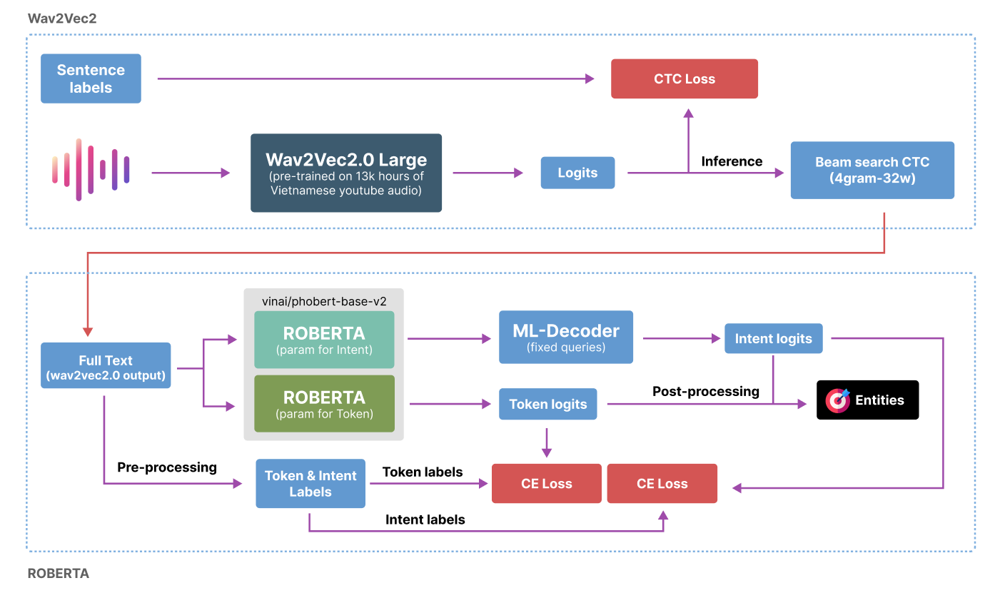

# Full pipeline


## Define task
- Stage 1: Audio to text. Optimize parameter via CTC Loss
- Stage 2: Text to entities. Token classify and sentence classify. Optimize pảaameter via Cross Entropy Loss
  - Entity: 
    - Format: ```json {"type": "<TYPE>", "filler": "<FILLER>"}```
    - Example: ```{"type": "command", "filler": "giảm"}, {"type": "device", "filler": "quạt"}```
  - Token classify:
    - Input: ```["kiểm","tra","giúp","tôi","mấy","cái","bóng","tròn","nhá"]```
    - Label: ```[   5,    5,    0,     0,    0,    0,    2,      2,   0]```
    - Explain: 
      - 5: value of **command** class
      - 2: value of **device** class
      - 0: value of **none** class
      - ```["kiểm","tra"] = [5, 5] => Entity{"type":"command", "filler": "kiểm tra"}```
      - ```["bóng","tròn"] = [2, 2] => Entity{"type": "device", "filler": "bóng tròn"}```
  - Intent classify:
    - Input: ```["kiểm","tra","giúp","tôi","mấy","cái","bóng","tròn","nhá"]```
    - Label: ```9```
  - INTENT MAPS:
    - ```json
        {
            "Giảm độ sáng của thiết bị": 0,
            "Đóng thiết bị": 1,
            "Hủy hoạt cảnh": 2,
            "Tắt thiết bị": 3,
            "Tăng âm lượng của thiết bị": 4,
            "Giảm mức độ của thiết bị": 5,
            "Bật thiết bị": 6,
            "Tăng mức độ của thiết bị": 7,
            "Tăng nhiệt độ của thiết bị": 8,
            "Kiểm tra tình trạng thiết bị": 9,
            "Mở thiết bị": 10,
            "Giảm âm lượng của thiết bị": 11,
            "Kích hoạt cảnh": 12,
            "Giảm nhiệt độ của thiết bị": 13,
            "Tăng độ sáng của thiết bị": 14
        }
- TOKEN MAPS:
    - ```json
        {
            "word": 0,
            "time at": 1,
            "device": 2,
            "changing value": 3,
            "scene": 4,
            "command": 5,
            "location": 6,
            "duration": 7,
            "target number": 8
        }
 
## Files
- **dataset.py**: contain custom Dataset for all model
- **utils.py**: contain some function for help training & inference
- **model.py**: contain structure of model
- **trainer.py**: trainer class help observe loss, acc during training
- **slu_data_augment.py (pre-processing)**: augmentation dataset for make ballance distribute
- **prepare_token_label.py (pre-processing)**: create token & intent labels for training *second-stage*
- **align_prediction.py (post-processing)**: remove empty entities or adding some *command* to entities list
- **W2V_v1.ipynb**: Fine tuning Wav2Vec2.0 version 1+2 (see hyperparameters in this notebook). Gready search for inference
- **W2V_v3.ipynb**: Fine tuning Wav2Vec2.0 version 3 + Beam search CTC 4gram with beam width is 32 for inference
- **Bert_SLU.ipynb**: Step-by-step fine tuning ROBERTA for this task 
- **build_ngram.sh**: Build 4gram .arpa file